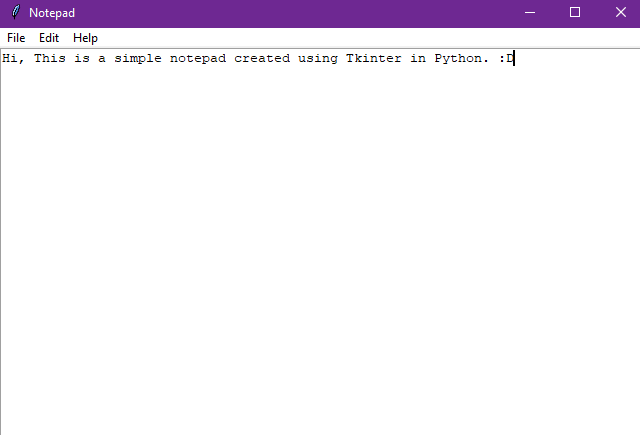

# Notepad

[](https://github.com/your-username/notepad/blob/main/LICENSE)
[](https://www.python.org/downloads/)
[](https://docs.python.org/3/library/tkinter.html)

A simple Notepad program built with Python and Tkinter.



> Make Sure to ⭐ the Repo if You liked it -- It Helps!

## Features

- Create new files
- Open existing files
- Save files
- Cut, copy, and paste text

## Prerequisites

- Python 3.7 or later
- Tkinter 8.6 or later (usually comes with Python installation)

## Installation

1. Clone the repository:

   ```bash
   git clone https://github.com/TheKaushikGoswami/100-Days-100-Programs.git
   ```

2. Navigate to the project directory:

   ```bash
   cd 100-Days-100-Programs/Programs/Day 1 - Notepad
   ```
3. Run the program:

   ```bash
   python main.py
   ```

## Usage

1. **New File**: Click on the "File" menu and select "New" to create a new file. This will clear the text area.

2. **Open File**: Click on the "File" menu and select "Open" to open an existing file. A file dialog will appear to choose the file to open.

3. **Save File**: Click on the "File" menu and select "Save" to save the current file. If the file has not been saved before, a file dialog will appear to choose the save location.

4. **Cut, Copy, and Paste**: Click on the "Edit" menu to access cut, copy, and paste options. These options work on the selected text in the text area.

5. **About Notepad**: Click on the "Help" menu and select "About Notepad" to view information about the Notepad program.

## License

This project is licensed under the MIT License. See the [LICENSE](https://github.com/TheKaushikGoswami/100-Days-100-Programs/blob/main/LICENSE) file for details.

## Author

Created by: [TheKaushikGoswami](https://github.com/TheKaushikGoswami)

## Acknowledgments

- This program is built using the [Tkinter](https://docs.python.org/3/library/tkinter.html) library.
- The program structure and features are inspired by the classic Notepad application.
- This program is a part of my "100 Days, 100 Programs" challenge.

---

Made with ❤️ in India