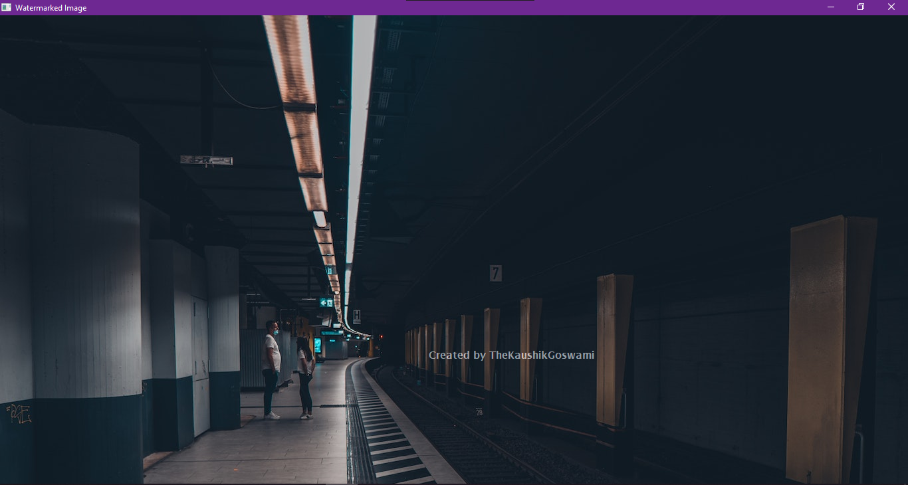

# Watermark Creator


The Watermark Creator is a Python application that allows you to easily apply a watermark image on top of a base image and generate a final image with the watermark embedded. It serves as a basic practical application of image manipulation using the OpenCV library.



> Make Sure to ⭐ the Repo if You liked it -- It Helps!

## Features

- Apply a watermark image on a base image
- Generate a final image with the watermark embedded
- Customize the position and transparency of the watermark

## Description

The Watermark Creator is a user-friendly tool designed to streamline the process of adding watermarks to images. By specifying the paths to the watermark image and the base image, the program automatically applies the watermark on top of the base image, resulting in a new image with the watermark embedded.

It provides a practical example of how to leverage the OpenCV library to accomplish this task efficiently.

## Installation

To run the Watermark Creator, make sure you have the following dependencies installed:

- Python 3.9 or higher
- OpenCV 4.5.3 or higher

You can install the required dependencies using pip:

```shell
pip install opencv-python
```

## Usage

- Provide the paths to the watermark image and the base image in the designated fields.
- Run the program to apply the watermark on the base image and generate the final image.
- Adjust the position and transparency of the watermark according to your preferences.
- Save the final image with the watermark embedded.

Please note that providing valid paths to both the watermark image and the base image is essential for the Watermark Creator to function correctly.

## Contributing

Contributions are welcome! If you have any ideas, suggestions, or improvements, please feel free to contribute to this project.

Commit your changes and push them to your branch.
Submit a pull request, describing your modifications and their benefits.

## License

This project is licensed under the MIT License. For more information, see the [LICENSE](https://github.com/TheKaushikGoswami/100-Days-100-Programs/blob/main/LICENSE) file.

## Author

Created by: [TheKaushikGoswami](https://github.com/TheKaushikGoswami)

## Acknowledgments

- This project utilizes the OpenCV library, a powerful tool for image processing and manipulation in Python. Special thanks to the creators and contributors of OpenCV for their remarkable work.
- This program is a part of my **"100 Days, 100 Programs"** challenge.

---

Made with ❤️ in India
