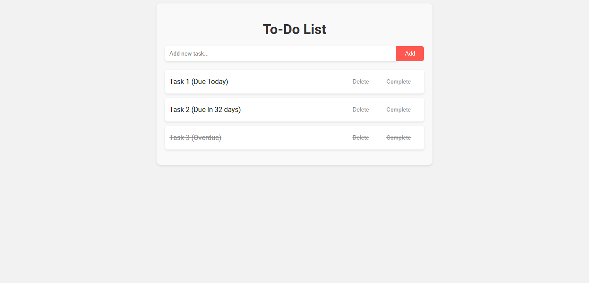

# To-Do List Application

A simple to-do list application with key features like task creation, organization, deletion, priority, sorting, search, completion, and responsive design.

> Make Sure to ⭐ the Repo if You liked it -- It Helps!

## Features

- **Task Creation:** Users can add tasks with a title, description, and due date.
- **Task Organization:** Tasks can be categorized into different lists or tags.
- **Task Deletion:** Users can easily delete tasks that are no longer needed.
- **Task Priority:** Users can assign priority levels to tasks to highlight their importance.
- **Task Sorting:** Tasks can be sorted based on due date, priority, or alphabetical order.
- **Task Search:** Users can search for specific tasks using keywords or tags.
- **Task Completion:** Users can mark tasks as complete, providing a visual indication of progress.
- **Responsive Design:** The application is designed to be responsive and compatible with different devices and screen sizes.

## Usage

1. Clone the repository or Download this folder.
2. Open the `index.html` file in your web browser.
3. Start adding, organizing, and managing your tasks!

## License

This project is licensed under the MIT License. For more information, see the [LICENSE](https://github.com/TheKaushikGoswami/100-Days-100-Programs/blob/main/LICENSE) file.

## Author

Created by: [TheKaushikGoswami](https://github.com/TheKaushikGoswami)

## Acknowledgments

- This program is a part of my **"100 Days, 100 Programs"** challenge.

---

Made with ❤️ in India
