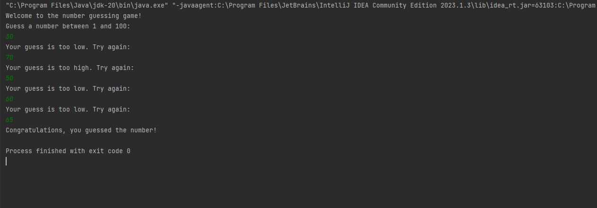

# Number Guessing Game

A simple number guessing game implemented in Java.

> Make Sure to ⭐ the Repo if You liked it -- It Helps!

## Features

- **Random Number Generation:** The program generates a random number between 1 and 100 for the player to guess.
- **User Input:** The player can enter their guess through the console.
- **Feedback:** The program provides feedback if the player's guess is too high or too low.
- **Win Condition:** When the player guesses the correct number, the program displays a congratulatory message and ends the game.
- **Looping Gameplay:** The game continues until the player guesses the correct number.

## How to Play

1. Clone or download the repository.
2. Open the `Main.java` file in a Java IDE or editor.
3. Run the `Main` class.

The program will generate a random number between 1 and 100. You need to guess the number by entering your guess when prompted. The program will provide feedback if your guess is too high or too low. Keep guessing until you guess the correct number.

## License

This project is licensed under the MIT License. For more information, see the [LICENSE](https://github.com/TheKaushikGoswami/100-Days-100-Programs/blob/main/LICENSE) file.

## Author

Created by: [TheKaushikGoswami](https://github.com/TheKaushikGoswami)

## Acknowledgments

- This program is a part of my **"100 Days, 100 Programs"** challenge.

---

Made with ❤️ in India
