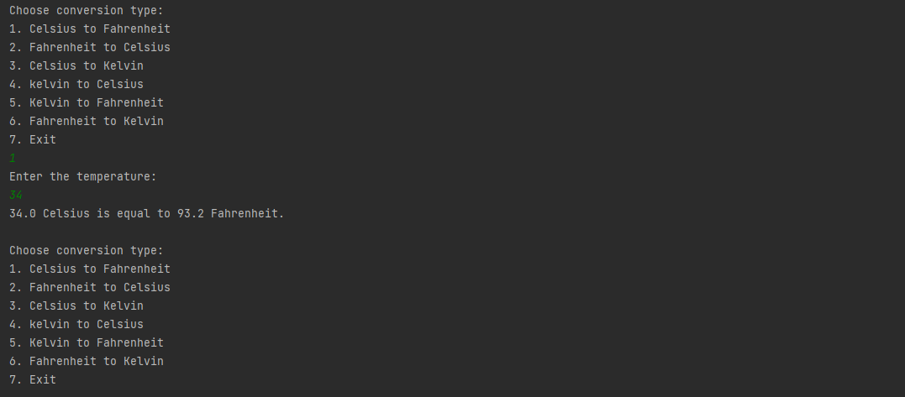

# Temperature Conversion

A simple temperature conversion program in Java that converts temperatures between **Celsius**, **Fahrenheit**, and **Kelvin** scales.

> Make Sure to ⭐ the Repo if You liked it -- It Helps!

## Usage

1. Clone the repository or Download the folder.
2. Open the project in your favorite Java IDE.
3. Run the `Main` class.
4. Choose the desired conversion type from the menu.
5. Enter the temperature value when prompted.
6. View the converted temperature in the desired scale.

## Supported Conversions

- Celsius to Fahrenheit
- Fahrenheit to Celsius
- Celsius to Kelvin
- Kelvin to Celsius
- Kelvin to Fahrenheit
- Fahrenheit to Kelvin

## License

This project is licensed under the MIT License. For more information, see the [LICENSE](https://github.com/TheKaushikGoswami/100-Days-100-Programs/blob/main/LICENSE) file.

## Author

Created by: [TheKaushikGoswami](https://github.com/TheKaushikGoswami)

## Acknowledgments

- This program is a part of my **"100 Days, 100 Programs"** challenge.

---

Made with ❤️ in India
