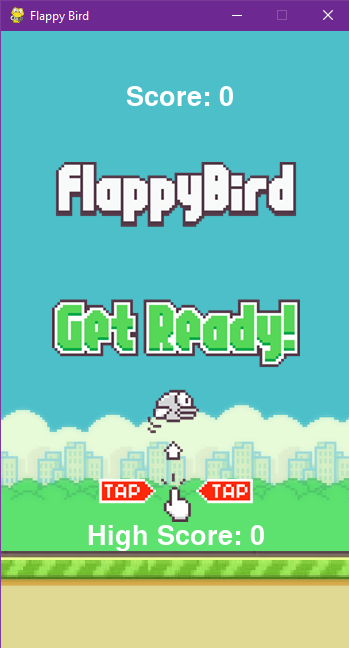

# Flappy Bird Game

[](https://www.python.org)
[](https://www.pygame.org)
[](LICENSE)

A simple implementation of the popular Flappy Bird game using Python and Pygame.



> Make Sure to ⭐ the Repo if You liked it -- It Helps!

## Installation

1. Clone the repository or Download this folder.
2. Install the required dependencies:
    ```bash
    pip install pygame
    ```

## Usage

1. Navigate to the project directory:

    ```shell
    cd Day 13 - Flappy Bird
    ```

2. Run the game:

    ```shell
    python flappy_bird.py
    ```

3. Enjoy playing Flappy Bird!

## Controls

- Press the **spacebar** or **left-click** the mouse to make the bird flap and fly.

## Gameplay

- The objective of the game is to navigate the bird through a series of pipes without colliding with them.
- Each successfully passed pipe earns the player one point.
- The game ends if the bird collides with a pipe or hits the ground.
- The highest score achieved in the current session is displayed as the "**High Score**."

## License

This project is licensed under the MIT License. For more information, see the [LICENSE](https://github.com/TheKaushikGoswami/100-Days-100-Programs/blob/main/LICENSE) file.

## Author

Created by: [TheKaushikGoswami](https://github.com/TheKaushikGoswami)

## Acknowledgments

- **Pygame** - A Python library for creating games
- This program is a part of my **"100 Days, 100 Programs"** challenge.

---

Made with ❤️ in India
