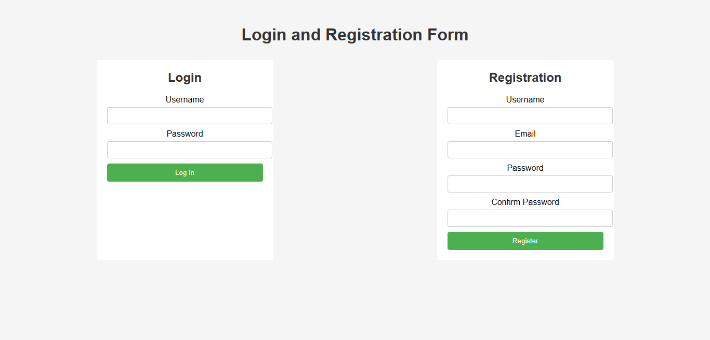

# Login and Registration Form

A simple login and registration form built using HTML, CSS, and JavaScript.

> Make Sure to ⭐ the Repo if You liked it -- It Helps!

## Features

- **User Registration:** Users can create a new account by providing their desired username, email address, and password.
- **Form Validation:** The form validates user inputs to ensure that the required fields are filled correctly.
- **Password Confirmation:** The registration form includes a password confirmation field to ensure that users enter the same password twice.
- **Error Handling:** The form provides error messages to guide users in case of invalid inputs or missing fields.
- **User Login:** Existing users can log in using their registered username and password.
- **Persistence:** The project can be extended to include backend functionality to store and authenticate user credentials.

## Requirements

- Web browser

## Usage

- To use the form, open the `index.html` file in your web browser.

## License

This project is licensed under the MIT License. For more information, see the [LICENSE](https://github.com/TheKaushikGoswami/100-Days-100-Programs/blob/main/LICENSE) file.

## Author

Created by: [TheKaushikGoswami](https://github.com/TheKaushikGoswami)

## Acknowledgments

- This program is a part of my **"100 Days, 100 Programs"** challenge.

---

Made with ❤️ in India
