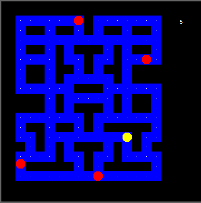

# Pacman Game

[](https://www.python.org)
[](https://www.pygame.org)
[](https://opensource.org/licenses/MIT)

A simple implementation of the classic Pacman game using Python's Turtle graphics library.



## Table of Contents

- [Introduction](#introduction)
- [How to Play](#how-to-play)
- [Installation](#installation)
- [Usage](#usage)
- [License](#license)
- [Acknowledgements](#acknowledgements)

## Introduction

This Python script simulates the iconic Pacman game. It uses the Turtle graphics library for rendering the game graphics and handling user input. The game features Pacman and ghosts, where the player controls Pacman and aims to collect all the dots while avoiding the ghosts.

## How to Play

- Use the arrow keys (Right, Left, Up, Down) to control Pacman's movement.
- Navigate Pacman to eat all the dots on the board.
- Beware of the ghosts! If a ghost touches Pacman, the game ends.
- The game keeps track of your score, which increases with each dot you eat.

## Installation

1. Clone the repository or Download this folder.
2. Install the required dependencies:
    ```bash
    pip install pygame freegames
    ```

## Usage

1. Navigate to the project directory:

    ```shell
    cd Day 13 - Pacman Game
    ```

2. Run the game:

    ```shell
    python main.py
    ```

3. Enjoy playing Flappy Bird!

## License

This project is licensed under the MIT License. For more information, see the [LICENSE](https://github.com/TheKaushikGoswami/100-Days-100-Programs/blob/main/LICENSE) file.

## Author

Created by: [TheKaushikGoswami](https://github.com/TheKaushikGoswami)

## Acknowledgments

- **Pygame** - A Python library for creating games
- **Freegames** - A collection of free Python games
- This program is a part of my **"100 Days, 100 Programs"** challenge.

---

Made with ❤️ in India
