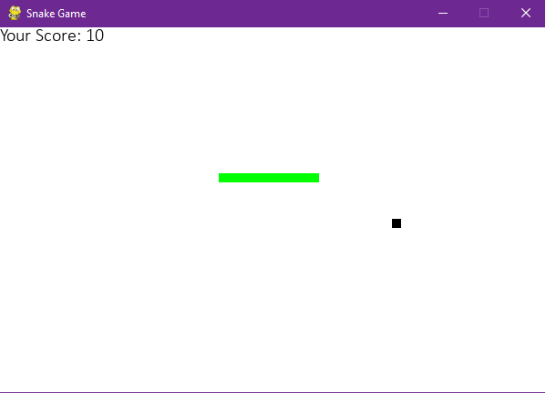
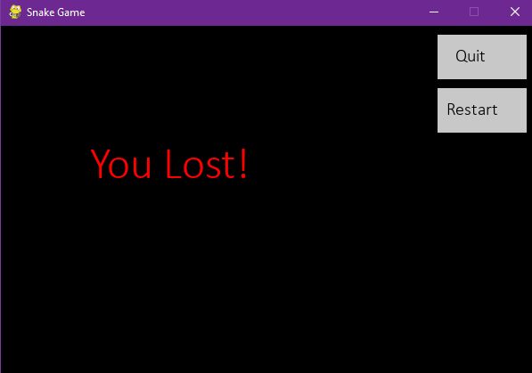

# Snake Game

[](https://www.python.org)
[](https://www.pygame.org)
[](LICENSE)

A classic Snake Game implemented in Python using the Pygame library. This game is part of the "100 Days, 100 Programs" challenge.




> Make Sure to ⭐ the Repo if You liked it -- It Helps!

## Features

- Control the snake using arrow keys
- Eat food to grow longer
- Avoid colliding with the boundaries or the snake's own body
- Restart the game if you lose

## Getting Started

Follow these instructions to get a local copy of the game up and running on your machine.

### Prerequisites

- Python 3.x
- Pygame 1.9.6

### Installation

1. Clone the repository:

   ```bash
   git clone https://github.com/your-username/your-repository.git
   ```

2. Install the required dependencies:
   
   ```bash
   pip install pygame
   ```

### Usage

1. Navigate to the project directory:
   
   ```bash
   cd 100-Days-100-Programs/Programs/Day 4 - Snake Game
   ```

2. Run the Snake Game:

   ```bash
   python main.py
   ```

3. Use the arrow keys to control the snake. Eat the food to grow longer and try to avoid collisions with the boundaries and the snake's own body.

4. Press the **Quit** button or close the window to exit the game.

## Contributing

Contributions are welcome! If you have any ideas, suggestions, or bug reports, please open an issue on GitHub. If you'd like to contribute to the project, fork the repository and submit a pull request.

## License

This project is licensed under the MIT License. For more information, see the [LICENSE](https://github.com/TheKaushikGoswami/100-Days-100-Programs/blob/main/LICENSE) file.

## Author

Created by: [TheKaushikGoswami](https://github.com/TheKaushikGoswami)

## Acknowledgments

- **Pygame** - A Python library for creating games
- This program is a part of my **"100 Days, 100 Programs"** challenge.

---

Made with ❤️ in India


