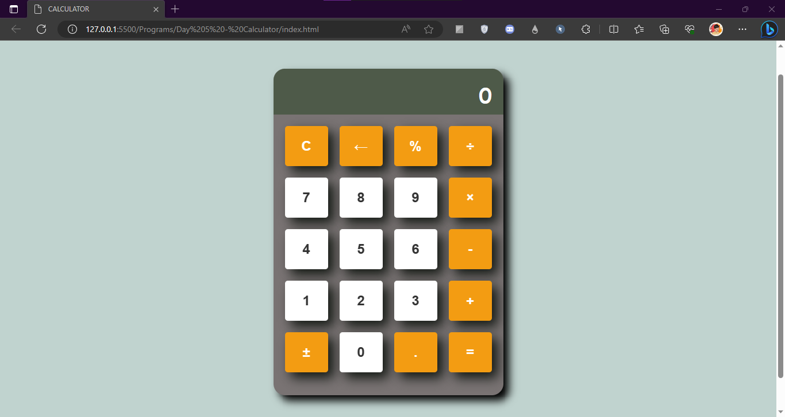

# Calculator

This repository contains a simple calculator built using HTML, CSS, and JavaScript. The calculator allows users to perform basic arithmetic operations.

> Make Sure to ⭐ the Repo if You liked it -- It Helps!

## Features

- Clear button (C) to reset the display.
- Backspace button (&larr;) to remove the last entered character.
- Percentage button (%) to calculate percentages.
- Division button (&divide;) to perform division.
- Multiplication button (&times;) to perform multiplication.
- Addition button (+) to perform addition.
- Subtraction button (-) to perform subtraction.
- Plus/Minus button (&plusmn;) to toggle between positive and negative numbers.
- Decimal button (.) to enter decimal numbers.
- Equal button (=) to calculate the result.

## Usage

To use the calculator, simply open the `index.html` file in your web browser by double-clicking it.

## Customization

You can customize the calculator's appearance by modifying the style.css file. Feel free to adjust colors, sizes, and other styles to suit your preferences.

## License

This project is licensed under the MIT License. For more information, see the [LICENSE](https://github.com/TheKaushikGoswami/100-Days-100-Programs/blob/main/LICENSE) file.

## Author

Created by: [TheKaushikGoswami](https://github.com/TheKaushikGoswami)

## Acknowledgments

- This program is a part of my **"100 Days, 100 Programs"** challenge.

---

Made with ❤️ in India

