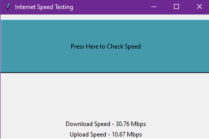

# Internet Speed Testing

[](https://www.python.org)
[](https://opensource.org/licenses/MIT)

This Python script allows you to check your internet speed using the `speedtest` library.



## Installation

1. Make sure you have Python 3.6 or above installed on your system. You can download the latest version of Python from the [official website](https://www.python.org/downloads/).
2. Install the required dependencies by running the following command:

    ```shell
   pip install speedtest-cli
    ```

## Usage

- Run the script using the following command:

    ```shell
    python internet_speed_test.py
    ```

- Click the **"Press Here to Check Speed"** button to initiate the speed test.

The script will perform a download and upload speed test and display the results in Mbps.

## Example Output

```yaml
Download Speed: 50.25 Mbps
Upload Speed: 25.10 Mbps
```

## Contributing

Contributions are welcome! If you have any ideas, suggestions, or bug reports, please open an issue on GitHub. If you'd like to contribute to the project, fork the repository and submit a pull request.

## License

This project is licensed under the MIT License. For more information, see the [LICENSE](https://github.com/TheKaushikGoswami/100-Days-100-Programs/blob/main/LICENSE) file.

## Author

Created by: [TheKaushikGoswami](https://github.com/TheKaushikGoswami)

## Acknowledgements

- `speedtest-cli` library by Sivel for performing the speed test.
- This program is a part of my **"100 Days, 100 Programs"** challenge.

---

Made with ❤️ in India