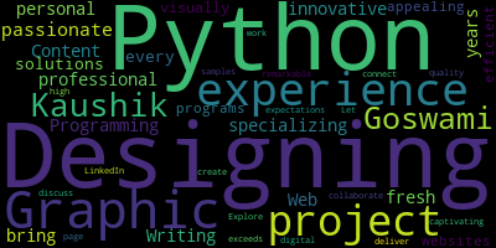

# WordCloud Generator

[](https://github.com/yourusername/your-repo/blob/main/LICENSE)
[](https://www.python.org/downloads/)

This Python script generates a word cloud visualization using the `wordcloud` and `matplotlib` libraries. It takes a paragraph of text as input and creates a visual representation where the size of each word corresponds to its frequency in the text.



## Installation

1. Make sure you have Python installed. If not, you can download it from the official website: [Python](https://www.python.org/downloads/).

2. Install the required libraries by running the following command:

   ```shell
   pip install wordcloud matplotlib
   ```

## Usage

1. Import the necessary libraries:

   ```python
   from wordcloud import WordCloud
   import matplotlib.pyplot as plt
   ```

2. Initialize the paragraph you want to visualize:

   ```python
   text = '''Your paragraph goes here.'''
   ```

3. Create a WordCloud object and generate the word cloud:

   ```python
   wordcloud = WordCloud().generate(text)
   ```

4. Display the word cloud:

   ```python
   plt.imshow(wordcloud, interpolation='bilinear')
   plt.axis("off")
   plt.show()
   ```

## License

This project is licensed under the MIT License. For more information, see the [LICENSE](https://github.com/TheKaushikGoswami/100-Days-100-Programs/blob/main/LICENSE) file.

## Author

Created by: [TheKaushikGoswami](https://github.com/TheKaushikGoswami)

## Acknowledgments

- [WordCloud](https://github.com/amueller/word_cloud) - WordCloud library used for generating word clouds.
- [Matplotlib](https://matplotlib.org/) - Matplotlib library used for visualizations.
- This program is a part of my **"100 Days, 100 Programs"** challenge.

---

Made with ❤️ in India
