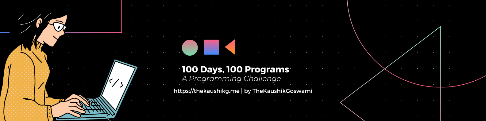

# 100 Days, 100 Programs

Welcome to my **"100 Days, 100 Programs"** challenge repository! Here, I will be sharing the programs I create as part of this challenge. Each day, I will be working on a different program, exploring various programming languages and building practical applications.

## Motivation

The purpose of this challenge is to enhance my programming skills, explore different programming languages and frameworks, and create useful and interesting programs along the way. By challenging myself to build a new program every day, I aim to sharpen my problem-solving abilities, expand my knowledge, and have a collection of diverse projects to showcase my learning journey.

## What's Inside? 

A quick look at the folder structure of this project.

    .
    ├── assets
    |   └───banner.png
    |
    ├── Programs
    │   ├─── Day 1 - Notepad
    │   |    ├─── screenshots
    |   |    |    └─── notepad.png
    |   |    ├─── main.py
    |   |    └─── README.md
    │   |
    |   ├─── Day 2 - GUI Stopwatch
    │   |    ├─── screenshots
    |   |    |    └─── stopwatch.png
    |   |    ├─── main.py
    |   |    └─── README.md
    │   |
    │   ├─── Day 3 - Watermark Creator
    |   |    ├─── assets
    |   |    |    ├─── image.png
    |   |    |    └─── watermark.png
    |   |    ├─── screenshots
    |   |    |    └─── watermark-creator.png
    |   |    ├─── final_image.jpg
    |   |    ├─── main.py
    |   |    └─── README.md
    |   |
    │   ├─── Day 4 - Snake Game
    |   |    ├─── screenshots
    |   |    |    ├─── gameplay.png
    |   |    |    └─── gameover.png
    |   |    ├─── main.py
    |   |    └─── README.md
    |   |
    |   ├─── Day 5 - Calculator
    |   |    ├─── screenshots
    |   |    |    └─── calculator.png
    |   |    ├─── index.html
    |   |    ├─── style.css
    |   |    ├─── script.js
    |   |    └─── README.md
    |   |
    |   ├─── Day 6 - BMI Calculator
    |   |    ├─── screenshots
    |   |    |    └─── bmi calculator.png
    |   |    ├─── index.html
    |   |    ├─── style.css
    |   |    ├─── script.js
    |   |    └─── README.md
    |   |
    |   ├─── Day 7 - GUI Speedtest
    |   |    ├─── screenshots
    |   |    |    └─── speedtest.png
    |   |    ├─── main.py
    |   |    └─── README.md
    |   |
    |   ├─── Day 8 - Ping Pong Game
    |   |    ├─── screenshots
    |   |    |    └─── ping_pong.png
    |   |    ├─── main.py
    |   |    └─── README.md
    |   |
    |   ├─── Day 9 - Wordcloud Generator
    |   |    ├─── screenshots
    |   |    |    └─── wordcloud.png
    |   |    ├─── main.py
    |   |    └─── README.md
    |   |
    |   ├─── Day 10 - To Do Manager
    |   |    ├─── screenshots
    |   |    |    └─── to_do.png
    |   |    ├─── index.html
    |   |    ├─── style.css
    |   |    ├─── script.js
    |   |    └─── README.md
    |   |
    |   ├─── Day 11 - Number Guessing Game
    |   |    ├─── screenshots
    |   |    |    └─── number_guessing.png
    |   |    ├─── Main.java
    |   |    └─── README.md
    |   |
    |   ├─── Day 12 -  Temperature Converter
    |   |    ├─── screenshots
    |   |    |    └─── temperature_converter.png
    |   |    ├─── Main.java
    |   |    └─── README.md
    |   |
    |   └─── Day 13 - Flappy Bird
    |        ├─── assets
    |        |    ├─── greenpipe.png
    |        |    ├─── img_45.png
    |        |    ├─── img_46.png
    |        |    ├─── img_47.png
    |        |    ├─── img_48.png
    |        |    ├─── img_49.png
    |        |    └─── img_50.png
    |        ├─── screenshots
    |        |    └─── flappy_bird.png
    |        ├─── main.py
    |        └─── README.md
    |
    ├── LICENSE
    └── README.md

Please feel free to explore these programs and provide feedback. I will continue updating this repository with new programs as I progress through the challenge. Stay tuned for more exciting projects in various programming languages!

## Contributing

Contributions to this repository are highly appreciated. If you have any program ideas, improvements, or suggestions, please feel free to contribute. Here's how you can get involved:

1. Fork the repository.
2. Create a new branch for your contribution.
3. Commit your changes and push them to your branch.
4. Submit a pull request, describing your modifications and their benefits.

Let's learn and grow together by sharing our knowledge and experiences!

## License

This project is licensed under the **MIT License**. See the [LICENSE](./LICENSE) file for more details.

## Contact

If you have any questions, suggestions, or just want to connect, feel free to reach out to me at thekaushikgoswami@gmail.com. I'm always excited to engage in discussions related to programming and learning.

## Author

Created by: [TheKaushikGoswami](https://github.com/TheKaushikGoswami)

---

Made with ❤️ in India

